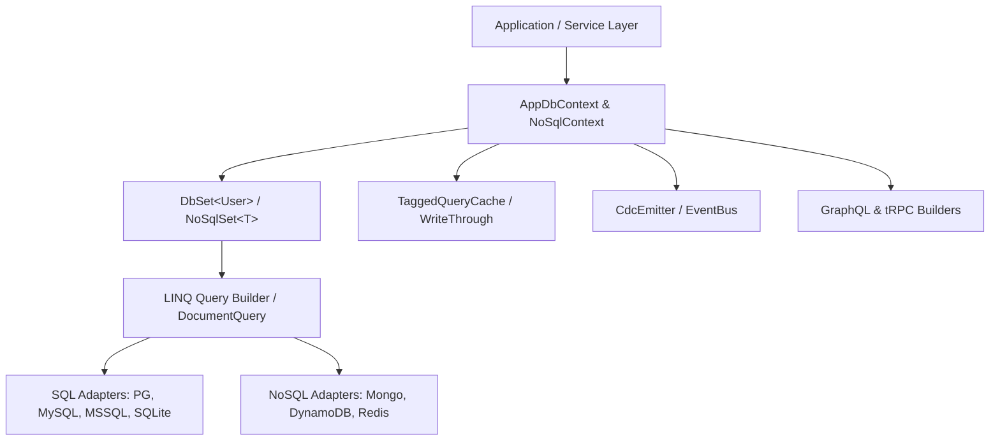

# EntityTS

**EntityTS** is an enterprise-grade, high-performance TypeScript ORM inspired by **Entity Framework Core (EF Core)** and **LINQ**.

It brings the architectural elegance of C# / .NET data access patterns to the TypeScript & Node.js ecosystem—delivering rich type safety, Unit of Work transaction management, native stored procedure execution, and modern cloud-native features like vector search and the transactional outbox pattern.

---

## Key Highlights

- **Fluent LINQ-Style Querying**: Chain `.where()`, `.orderBy()`, `.select()`, `.include()`, `.toCursorPage()`, and aggregations with complete compile-time type inference.
- **DbContext & DbSet Pattern**: Organize database entities into strongly-typed contexts with automatic relationship hydration and lifecycle hooks.
- **First-Class Stored Procedures**: Native support for `@StoredProcedure`, `@SqlFunction`, input/output parameters, TVPs (Table-Valued Parameters), and multiple result sets.
- **Universal Multi-Database & NoSQL Support**: Single consistent API for **PostgreSQL**, **SQLite**, **MySQL**, **SQL Server (MSSQL)**, plus first-class NoSQL adapters for **MongoDB**, **Amazon DynamoDB**, and **Redis**.
- **Window Functions & Streaming**: Native SQL window functions (`ROW_NUMBER`, `RANK`, `DENSE_RANK`, `LEAD`, `LAG`, partition/order frames) and async streaming cursor iteration (`for await (const row of db.users.stream())`).
- **High-Performance Caching**: Tagged query cache (`TaggedQueryCache`) with tag-based invalidations, multi-tier L1/L2 cache (`EntityCache`), and write-through/write-around patterns (`WriteThroughCache`).
- **Zero-Boilerplate API Generation**: Instant **GraphQL** schema & resolver generation with `DataLoaderBatcher` (zero N+1 queries) and typed **tRPC** router builder (`TrpcRouterBuilder`).
- **Realtime Change Data Capture (CDC)**: Stream entity mutation events (`CdcEmitter`) across inserts, updates, and deletes with before/after state diffing.
- **Enterprise Reliability**: Built-in **Transactional Outbox Pattern**, **Distributed Idempotency Engine**, **Optimistic & Pessimistic Locking**, and **Global Multi-Tenant Query Filters**.
- **Testing Kit**: Zero-IO unit testing with `InMemoryContext`, fluent data generation with `FixtureFactory`, and SQL statement assertions with `SqlAssertions`.
- **AI-Ready with pgvector**: First-class `@Vector` decorator with nearest-neighbor vector distance searches (cosine, L2, inner product).

---

## Architecture Overview

---

## Next Steps

- Check out the [Quick Start Guide](./getting-started/quickstart.md) to set up your first DbContext in 2 minutes.
- Explore [NoSQL & Document Databases](./nosql/overview-and-adapters.md).
- Learn about [Window Functions](./querying/window-functions.md) and [Streaming Pagination](./querying/pagination.md).
- Discover [GraphQL & tRPC Integration](./advanced/graphql-and-trpc.md) and [Advanced Caching](./advanced/caching.md).
- Dive into the [Testing Kit](./advanced/testing-testkit.md).

---

## Community & Support

- **GitHub Repository**: [github.com/nitishprajapati5/EntityTS](https://github.com/nitishprajapati5/EntityTS)
- **Discussions & Q&A**: [GitHub Discussions](https://github.com/nitishprajapati5/EntityTS/discussions)
- **Bug Reports & Features**: [GitHub Issues](https://github.com/nitishprajapati5/EntityTS/issues/new/choose)
- **npm Package**: [`entityts-orm` on npm](https://www.npmjs.com/package/entityts-orm)
