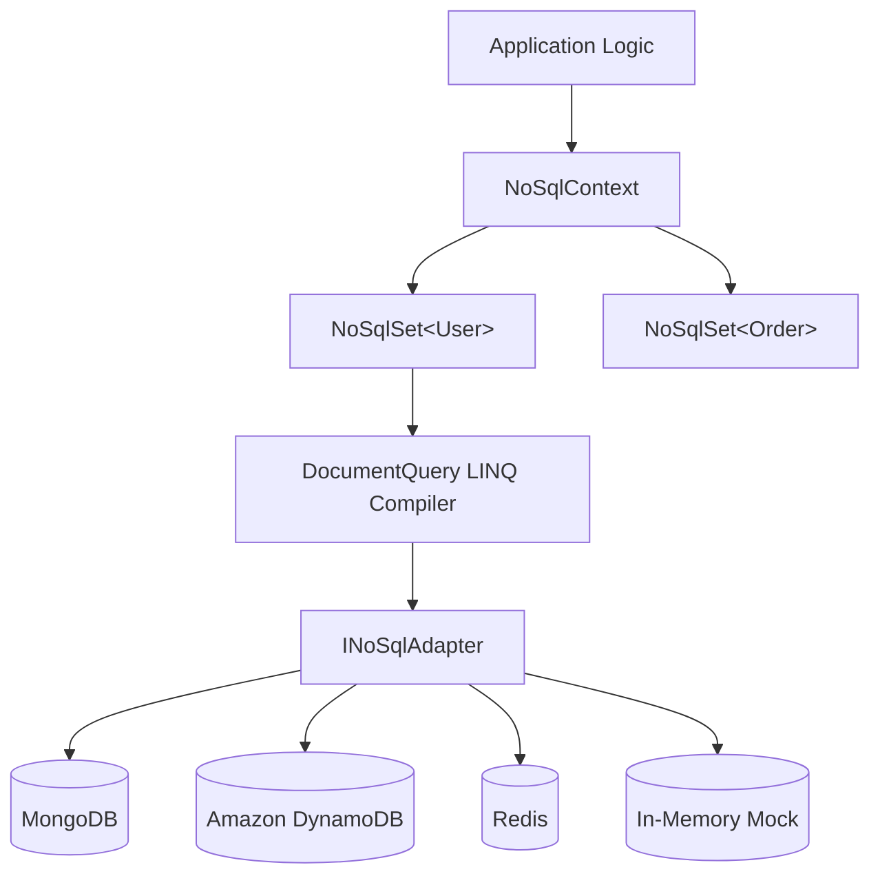

# NoSQL & Multi-Model Data Access

EntityTS brings EF Core and LINQ semantics to NoSQL and document databases, offering a unified querying experience whether you are persisting to relational SQL, MongoDB, Amazon DynamoDB, or Redis.

With `NoSqlContext` and `NoSqlSet<T>`, you can write declarative TypeScript queries that are compiled into native driver expressions and aggregation pipelines.

---

## Architecture



---

## Supported NoSQL Adapters

### 1. MongoDB (`MongoNoSqlAdapter`)

Native MongoDB driver integration supporting filters, sorts, projections, and aggregation pipelines:

```ts
import { MongoClient } from 'mongodb';
import { NoSqlContext, MongoNoSqlAdapter } from 'entityts';

const client = new MongoClient('mongodb://localhost:27017');
const adapter = new MongoNoSqlAdapter(client, 'my_database');
const ctx = new NoSqlContext(adapter);

await ctx.connect();
```

### 2. Amazon DynamoDB (`DynamoDbAdapter`)

Maps collections to DynamoDB tables using partition and sort keys:

```ts
import { DynamoDBClient } from '@aws-sdk/client-dynamodb';
import { DynamoDBDocumentClient } from '@aws-sdk/lib-dynamodb';
import { NoSqlContext, DynamoDbAdapter } from 'entityts';

const client = new DynamoDBClient({ region: 'us-east-1' });
const docClient = DynamoDBDocumentClient.from(client);

const adapter = new DynamoDbAdapter(docClient, {
  tablePrefix: 'prod_',
  primaryKeyMapping: {
    users: 'id',
    orders: 'orderId',
  },
});

const ctx = new NoSqlContext(adapter);
```

### 3. Redis (`RedisAdapter`)

High-speed document and key-value storage using Redis hashes, JSON, and keysets:

```ts
import { createClient } from 'redis';
import { NoSqlContext, RedisAdapter } from 'entityts';

const redis = createClient({ url: 'redis://localhost:6379' });
const adapter = new RedisAdapter(redis, { keyPrefix: 'app:' });
const ctx = new NoSqlContext(adapter);
```

### 4. Mock NoSQL (`MockNoSqlAdapter`)

Zero-dependency in-memory NoSQL adapter designed for lightning-fast unit tests:

```ts
import { NoSqlContext, MockNoSqlAdapter } from 'entityts';

const mock = new MockNoSqlAdapter({
  users: [
    { id: '1', name: 'Alice', age: 28, role: 'admin' },
    { id: '2', name: 'Bob', age: 34, role: 'member' },
  ],
});
const ctx = new NoSqlContext(mock);
```

---

## Working with Collections (`NoSqlSet<T>`)

Access typed collections using `ctx.collection<T>(nameOrClass)`:

```ts
interface User {
  id: string;
  name: string;
  email: string;
  age: number;
  tags: string[];
}

const users = ctx.collection<User>('users');

// Insert document
const newUser = await users.insert({
  id: 'usr_101',
  name: 'Sara Connor',
  email: 'sara@example.com',
  age: 32,
  tags: ['rebel', 'leader'],
});

// Find by ID
const found = await users.findById('usr_101');

// Update document
await users.update('usr_101', { age: 33 });

// Delete document
await users.delete('usr_101');
```

---

## Multi-Document ACID Transactions

For databases that support multi-document transactions (e.g., MongoDB replica sets):

```ts
const tx = await ctx.beginTransaction();

try {
  await users.insert(
    { id: '1', name: 'Alice', email: 'alice@example.com', age: 25, tags: [] },
    { transaction: tx },
  );

  await users.update('2', { age: 30 }, { transaction: tx });

  await tx.commit();
} catch (err) {
  await tx.rollback();
  throw err;
}
```
